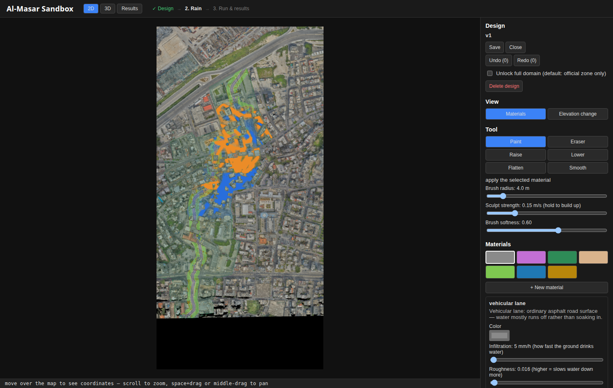

# Beirut — Al-Masar Al-Akhdar Green Corridor Pluvial Flood Study

A GPU shallow-water (rain-on-grid) flood-modelling pipeline for the
**Al-Masar Al-Akhdar / Fouad Boutros green corridor** in Beirut, built from a
39 GB airborne LiDAR survey. It answers two questions: *where does rainwater
go in the corridor and the streets around it today*, and *how much flooding
does the proposed green corridor remove — before and after*.

The corridor is modelled at high fidelity from its official geometry: a
right-of-way ribbon whose porous sidewalks, bikelanes, bioswales, rain
gardens, bioretention ponds and terraces each carry their own infiltration,
roughness and detention. The model is cross-validated against two independent
flood engines and an international benchmark.

## Key results

Before/after the green corridor, at 0.5 m over the corridor domain, across a
frequent (T2), observed (25 Nov 2025) and severe (T50) storm:

- **Flooded street area on the corridor falls 18–47 %** (47 % frequent, 36 %
  observed, 18 % severe); on walkable surfaces specifically, 28–64 %.
- **The benefit reaches ~2 blocks** (≈28–32 % less flooding within 25 m,
  fading by ~100 m).
- **Infiltration roughly triples**, absorbing 1000–2100 m³ per storm — more
  than the rain landing on the corridor, as it also intercepts upslope runoff.
- **Peak discharge toward the port is cut 18–22 %** and delayed.
- A **targeted drain optimiser** places 77 inlets on the ponding hotspots and
  captures 86 % of the volume that a 600-inlet blanket removes.

Validation: agreement with LISFLOOD-FP (IoU 0.81, RMSE 8.5 cm on a test block)
and the independent full-shallow-water solver SynxFlow (corridor IoU 0.61,
depth correlation 0.88, RMSE 11 cm), and in-cluster results on the UK
Environment Agency Néelz–Pender **Test 8A** benchmark.

## Reproducing the results

See **[REPRODUCE.md](REPRODUCE.md)** for the full, step-by-step workflow. In
short, the terrain grids the solver consumes are included, so the corridor
study reproduces without the raw point cloud:

```bash
python scripts/bake_corridor.py --terrain output/terrain_cut_0.5 \
    --material output/corridor_gi_cut/material.npy --out output/terrain_cut_corridor
bash   scripts/run_corridor_study.sh      # before / after / drain scenarios
python scripts/analyze_corridor.py        # corridor metrics + figures
```

## Repository layout

| Path | Contents |
|---|---|
| `scripts/` | the full pipeline (see below) |
| `output/terrain_cut_0.5/` | terrain grids for the corridor domain — the solver's direct inputs |
| `output/corridor_gi_cut/` | the corridor material raster (`material.npy`), centreline and summary |
| `output/masar_zone_official.json`, `output/masar_fb_highway_official.json` | the official Al-Masar zone polygon and Fouad Boutros right-of-way |
| `scenarios/`, `storms/` | scenario and design-storm definitions |
| `output/crosscheck/`, `output/ea8/`, `output/*/metrics*.json` | validation, benchmark and result metrics |
| `docs/` | research notes, validation write-up ([crosscheck_lisflood.md](docs/crosscheck_lisflood.md)), benchmark references |
| `PLAN.md` | project plan and phase gates |

Large binaries — the LiDAR point clouds, raster stacks, per-timestep run
frames and videos — are excluded via `.gitignore`; they are reproducible from
the code plus the source survey. The cropped corridor point cloud is published
separately as a Release asset (see below).

## The pipeline

The corridor study is produced by these scripts (all take `--help`):

**Terrain (from the LiDAR survey)**
- `build_stack.py` — streams the LAS once, grids per cell (min/max Z, count, RGB).
- `build_terrain.py` — DEM cleaning, land-cover classification, sea/outflow
  masking, courtyard detection, roof/courtyard rain rerouting, Manning and
  infiltration rasters, static fill-bound, gauges.
- `cut_domain.py` / `crop_cloud.py` — cut the high-resolution corridor domain
  to the corridor plus its D8 upslope catchment.

**Green corridor**
- `build_corridor_gi.py` — from the official zone polygon, derive the
  right-of-way centreline and place the material bands (vehicular lane, porous
  bikelane, bioswale, porous sidewalk, garden), with bioretention ponds at the
  terrain low points and terraces on the steep segments.
- `bake_corridor.py` — apply each material's infiltration, roughness and
  detention (literature-based `PROPS` table) into the terrain.

**Simulation and drainage**
- `flood_gpu.py` — the GPU 2D shallow-water solver (Bates et al. 2010 inertial
  scheme) with rain-on-grid, infiltration, detention and drain inlets; mass
  balance closes to ~0.001 %.
- `drains.py` — a uniform inlet network; `optimize_drains.py` — a targeted,
  minimal inlet set placed on the ponding hotspots.
- `run_corridor_study.sh` — the before/after/drain scenario runs.
- `analyze_corridor.py` — corridor-focused metrics and figures.

**Validation**
- `validate.py` — analytic benchmarks (closed-box conservation, plane runoff
  vs Manning, lake-at-rest) and reference-port equivalence.
- `export_ascii.py`, `crosscheck.py`, `synxflow_run.py`, `lisflood_mass.py`,
  `run_validation.sh` — cross-engine comparison against LISFLOOD-FP and
  SynxFlow.
- `benchmark_ea8.py` — the UK EA Test 8A benchmark.

## The corridor point cloud

The 8.4 GB cropped corridor LiDAR is too large for the git tree. It is
published as a **GitHub Release asset** in compressed LAZ form (~2.9 GB, split
into two sub-2 GB parts). To use it:

```bash
cat cut_masar.laz.part00 cut_masar.laz.part01 > cut_masar.laz   # reassemble
sha256sum cut_masar.laz    # expect 3cfbd75b71f08a6f03408145cc81fcbfd156c8bebeaa7a49e650e7cf3cd2d505
```

Reading it needs `laspy` with the `lazrs` backend. It is only required to
rebuild the terrain grids from scratch; the included grids already provide
everything the simulations consume.

## Environment

Python 3.12 with a geospatial + PyTorch stack (GPU optional but recommended):

```bash
python -m venv .venv && source .venv/bin/activate
pip install numpy scipy torch rasterio shapely matplotlib pillow laspy lazrs
```

Add `--device cpu` to any simulation command to force CPU. The LiDAR scripts
stream in chunks; pass `--workers 4` on memory-constrained machines.

## Interactive sandbox

A browser tool where a planner or engineer sculpts the corridor terrain,
paints materials with a brush, configures rain and runs/compares
simulations — no command line required. It wraps the same solver and
bake logic used by the pipeline above (a design with no edits reproduces
the pipeline's own results bit-for-bit).



```bash
# one-time setup
/home/stathisliap/Work/.venv/bin/pip install fastapi "uvicorn[standard]" pillow
cd webui && npm install && cd ..

# dev (two terminals): backend --------------------------------------------
/home/stathisliap/Work/.venv/bin/uvicorn sandbox.server:app --reload --port 8008
# frontend -----------------------------------------------------------------
cd webui && npm run dev   # open http://localhost:5173

# production (one command, after building the frontend once): -------------
bash sandbox/run.sh       # open http://localhost:8008
```

Paint a material or sculpt the ground, pick a storm (or draw a custom one),
press Run, and compare before/after in the Results tab — everything is
editable through the official Al-Masar zone by default, with an "unlock
full domain" toggle for wider experiments. The full implementation guide
(architecture, data contracts, API reference) is at
**[docs/SANDBOX_GUIDE.md](docs/SANDBOX_GUIDE.md)**.

## Modelling notes

- **Elevations are ellipsoidal**; the local sea surface sits near +26 m, so
  cells below +27.5 m are masked as outflow rather than thresholded against 0.
- **Roof and courtyard rainfall** is rerouted to the nearest street cell;
  courtyards are excluded from the street-flooding statistics.
- **Drain capacity is an assumption** (no per-inlet data exists); scenarios are
  reported as differences, which are robust, rather than absolute depths.
- **Supercritical street flow of 6–8 m/s** is physical on the steep, smooth
  streets here; the sanity screens only flag values above 10 m/s.
- **Material properties are literature values** (FAWB 2009 bioretention,
  permeable-pavement and vegetated-surface references), not site-measured.
